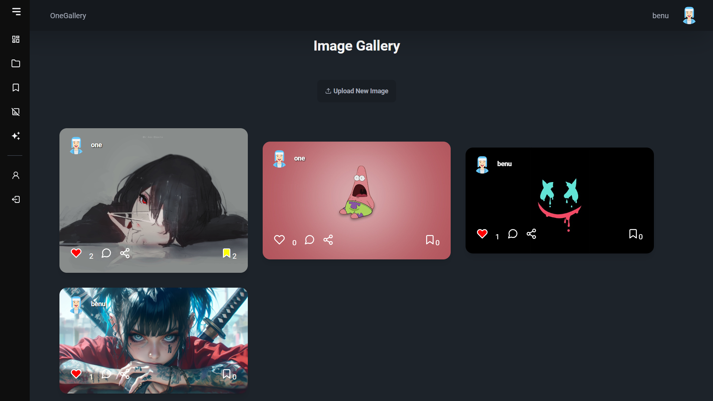
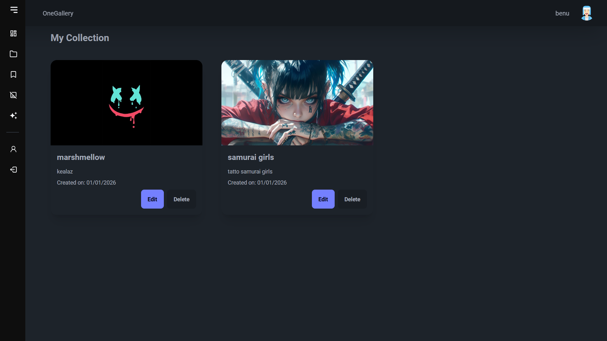
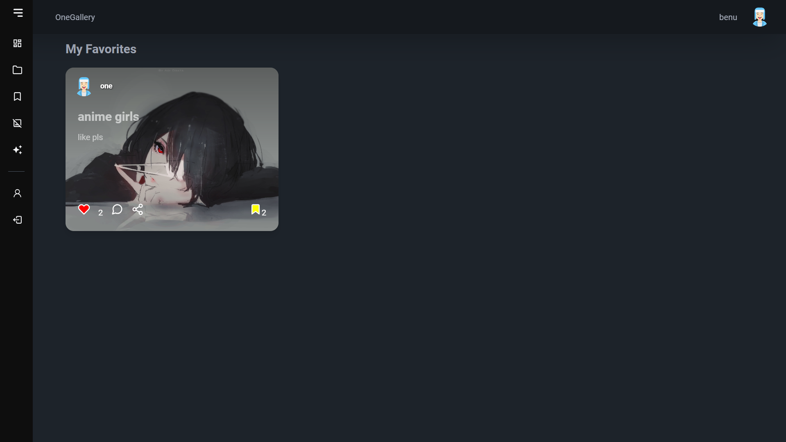
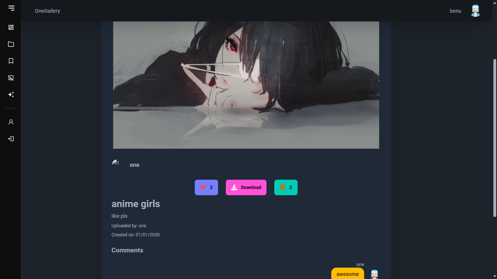
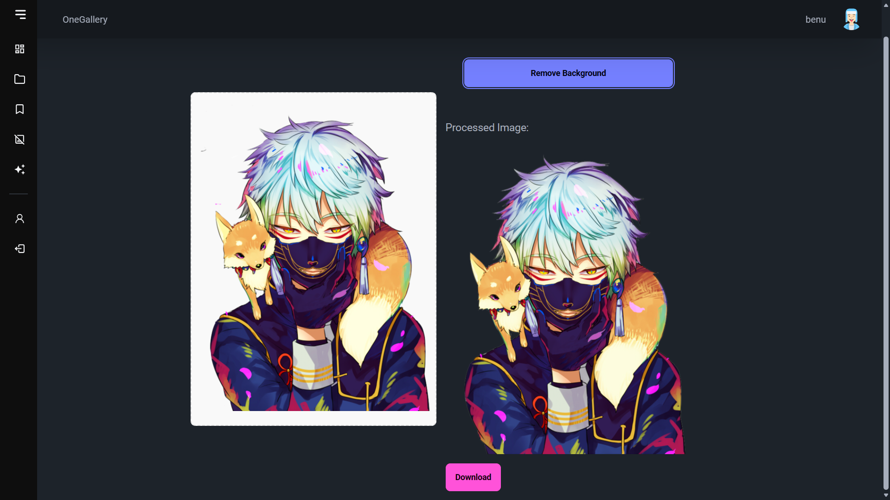
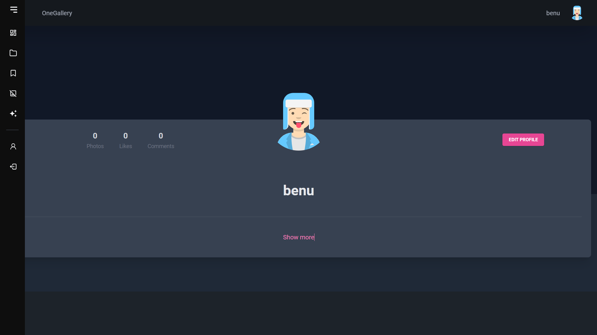
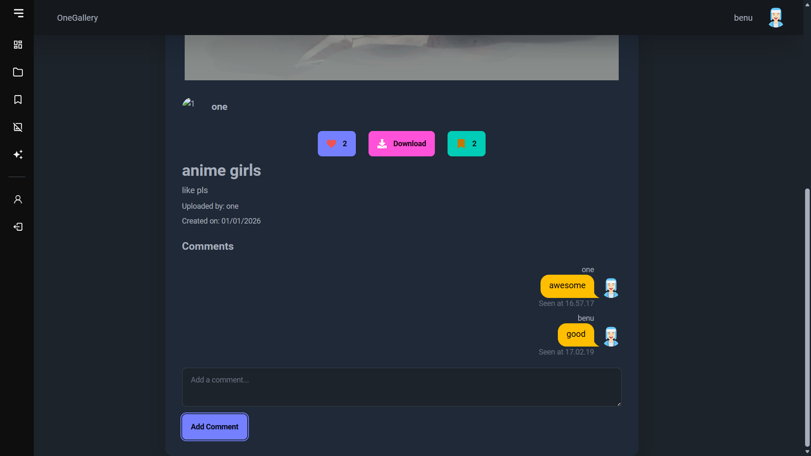

# 📸 Image Collection App

Aplikasi **Image Collection** dengan fitur lengkap seperti upload gambar, bookmark, like & comment, edit gambar, remove background (AI), hingga manajemen akun.

**Tech Stack:**

- Backend: Laravel
- Frontend: React + Vite
- AI Service: Python (Flask + Rembg)

---

## 📑 Preview

### 🧭 Explore Page



### 📁 My Collection



### 🔖 Saved / Bookmark Page



### 🖼️ Detail Image Page



### ✂️ Remove Background Page



### 👤 Profile Page



### 💬 Comment Feature



---

## 🚀 Fitur Aplikasi

- 🔐 Login & Signup
- 🔖 Bookmark Gambar
- ❤️ Like & Comment
- 🖼️ Kelola gambar yang kamu posting
- ⬆️ Upload gambar
- ✏️ Edit gambar
- ❌ Hapus gambar
- ⬇️ Download gambar
- 🧑‍💻 Edit profile
- 🪄 Remove background (AI)

---

## 🛠️ Cara Menjalankan Proyek

### 1️⃣ Clone Repository

```bash
git clone https://github.com/oneraid/CRUD_imagecollection_laravelreact.git
cd CRUD_imagecollection_laravelreact
```

---

### 2️⃣ Backend (Laravel)

```bash
# Masuk ke folder Laravel
cd Laravel

# Install dependency
composer install

# Rename file environment
cp .env.example .env

# Generate app key
php artisan key:generate

# Setting database di file .env (sesuaikan dengan konfigurasi database Anda)

# Migrasi database
php artisan migrate

# Jalankan server Laravel
php artisan serve
```

**⚙️ Update php.ini** (agar upload file tidak dibatasi)

```ini
upload_max_filesize = 100M
post_max_size = 100M
```

---

### 3️⃣ Frontend (React + Vite)

```bash
# Masuk ke folder React
cd react

# Install dependency
npm install

# Jalankan server React
npm run dev
```

---

### 4️⃣ AI Remove Background (Python + Flask)

```bash
# Masuk ke folder Python
cd python

# Buat virtual environment
python -m venv venv

# Aktifkan venv
# Windows:
venv\Scripts\activate
# Linux/Mac:
source venv/bin/activate

# Install dependencies AI
pip install flask flask-cors rembg

# Jalankan AI server
python app.py
```

---

## 🧩 Arsitektur Sistem

```
Laravel (Backend API)
   └── Autentikasi, database, upload file

React (Frontend)
   └── UI, request API Laravel, halaman gambar

Python AI (Flask + Rembg)
   └── Remove background dari gambar
```

---

## 👨‍💻 Author

**Ridhwan / oneraid**  
GitHub: [https://github.com/oneraid](https://github.com/oneraid)
